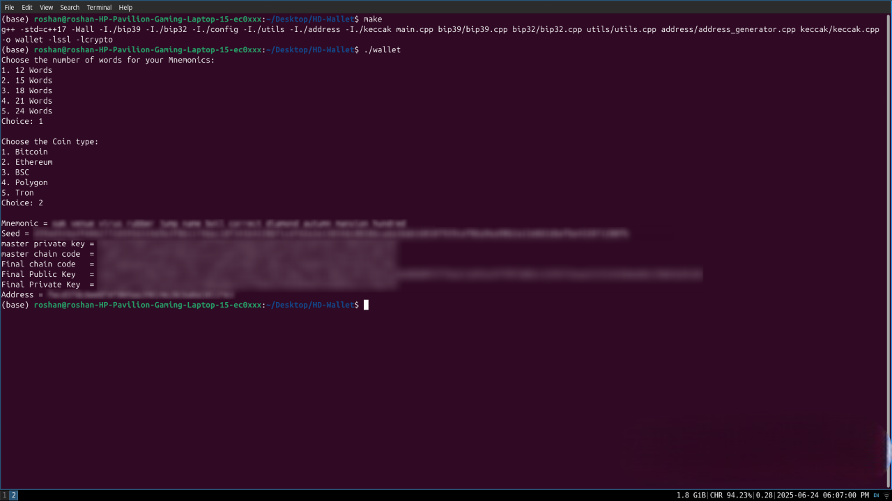

<h1 align="center">

</h1>  

# HD Wallet
Easily generate secure cryptocurrency wallets with this modular, standards-compliant HD wallet engine built in C++. Whether you're learning how wallet internals work, building blockchain tools, or experimenting with key derivation and address formats, this CLI tool helps you create mnemonics, derive keys using BIP-32, and generate addresses with precision all with minimal dependencies and full control.

## Features
* Create secure wallet phrases of various lengths  
* Generate a full set of keys from a single phrase  
* Get both public and private keys instantly  
* Create addresses compatible with multiple blockchain formats  
* Select from different coin types at runtime  
* Use the tool entirely from your terminal  
* Designed to be fast, lightweight, and easy to extend  

## Prerequisites
* Make sure you have:
* A Linux environment (or WSL on Windows)
* A C++17-compatible compiler (e.g. `g++`)
* OpenSSL development libraries (`libssl-dev`)
* `make` installed for building the project

## Setup
1. Clone the repository and navigate to the directory.
```bash
git clone https://github.com/your-username/HD-Wallet.git
cd HD-Wallet
```
2. Install dependencies (on Debian/Ubuntu/WSL).
```bash
sudo apt update
sudo apt install build-essential libssl-dev
```
3. Build the project
```bash
make
```
4. Run the wallet
```bash
./wallet
```
## Example Output
<h1 align="center">
>
</h1>  
